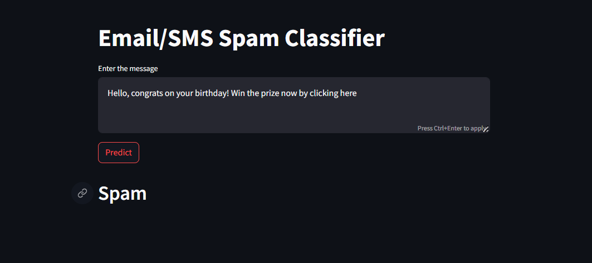
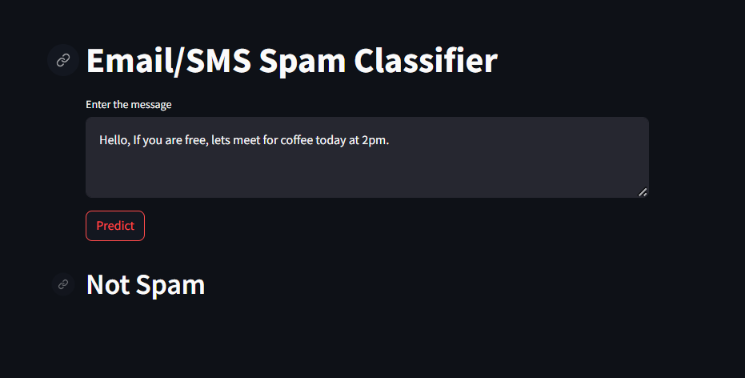

# SMS Spam Classifier

Welcome to the SMS Spam Classifier project! This project utilizes a Random Forest classifier from scikit-learn to predict whether an SMS message is spam or not. The classifier is trained on the Kaggle SMS spam dataset.

## Project Overview

The goal of this project is to create a machine learning model that can effectively classify SMS messages as spam or not spam. The project involves the use of the following tools and technologies:

- **Machine Learning Library:** [scikit-learn](https://scikit-learn.org/)
- **Front-end Framework:** [Streamlit](https://www.streamlit.io/)
- **Integrated Development Environment (IDE):** [PyCharm](https://www.jetbrains.com/pycharm/)
- **Visualization Libraries:** [Matplotlib](https://matplotlib.org/), [Seaborn](https://seaborn.pydata.org/)
- **Natural Language Processing (NLP) Libraries:** [NLTK](https://www.nltk.org/)
- **Word Cloud Visualization:** [WordCloud](https://github.com/amueller/word_cloud)
- **TF-IDF Vectorizer:** Used for text feature extraction

## Features

- Random Forest classifier for SMS spam prediction
- Basic front-end website using Streamlit
- Visualizations of frequent spam message words using WordCloud
- Utilization of common Python libraries for data analysis and visualization
- TF-IDF vectorizer for text feature extraction

## Dataset

The dataset used for training and testing the SMS Spam Classifier is sourced from Kaggle. It contains labeled SMS messages, allowing the model to learn patterns indicative of spam or non-spam messages.

**Kaggle Dataset Link:** [SMS Spam Collection Dataset](https://www.kaggle.com/datasets/uciml/sms-spam-collection-dataset)

## Dependencies

Make sure you have the required dependencies installed before running the project. You can install them using the following command:

```bash
pip install -r requirements.txt
```
The requirements.txt file includes the necessary Python libraries such as scikit-learn, Streamlit, Matplotlib, NLTK, Seaborn, WordCloud, and others.

# Running the Project
To run the project, follow these steps:

## Clone the repository:

```bash
git clone https://github.com/your-username/sms-spam-classifier.git
cd sms-spam-classifier
```
## Install dependencies:

```bash
pip install -r requirements.txt
```
## Run the Streamlit app:

```bash
streamlit run app.py
```
The Streamlit app will be accessible in your browser.

#Screenshots





# Acknowledgments

- Kaggle for providing the SMS spam dataset
- The open-source community for developing and maintaining the tools and libraries used in this project

Feel free to explore and contribute to the project. Happy coding!
